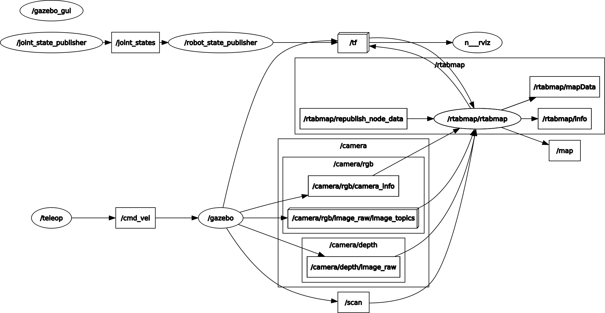
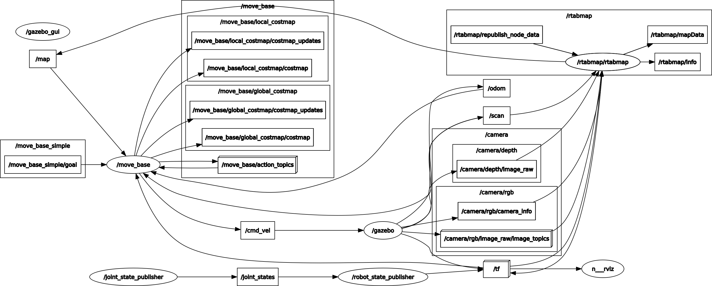

# Map My World
The aim of the project is to create a 2D occupancy grid and 3D octomap from a simulated environment using your own robot with the RTAB-Map package

`my_robot`: Package which includes robot model, rtab-map, move_base parameters, rviz configuration, teleoperation script. 

## Mapping
First target is to create a 2D occupancy grid and 3D octomap

### Node
* `rtabmap`: Which subscribes to **/camera/rgb/camera_info**, **/camera/dept/image_raw**, **/camera/rgb/image_raw**, **/scan** topic and publishes **/map**, **/rtabmap/mapData**  topic. 
* `teleop`: Which publishes **/cmd_vel** topic. 

<p align="center">
  
  <br>Rosgraph of rtabmap mapping
</p>

### How to use
```bash
roslaunch my_robot world.launch
roslaunch my_robot rtab.launch 
roslaunch my_robot teleop.launch
```
When your map is ready, you can close rtab.launch terminal

- To view RTAB-Map data
```bash
rtabmap-databaseViewer <database_directory>
```

## Localization & Navigation
Second target is to load previously created map and start navigation

### Node
* `rtabmap`: Which subscribes to **/camera/rgb/camera_info**, **/camera/dept/image_raw**, **/camera/rgb/image_raw**, **/scan** topic and publishes **/map**, **/rtabmap/mapData**  topic. 
* `move_base`: Which subscribes to **/map**, **/tf**, **/odom** topic and publishes **/cmd_vel** topic.

<p align="center">
  
  <br>Rosgraph of the rtabmap & move_base localization
</p>

### How to use
```bash
roslaunch my_robot world.launch 
roslaunch my_robot rtab.launch localization:=true database_path:=<database_directory>
```


